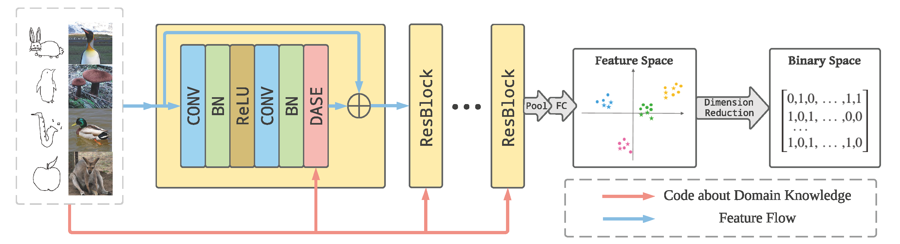

# SBIR-DASE-MEMS

This is the source code of Paper P. Lu, G. Huang, H. Lin, *et.al.*  Domain-Aware SE Network for Sketch-based Image Retrieval with Multiplicative Euclidean Margin Softmax. In Proc. ACM Multimedia 2021. [[paper](https://arxiv.org/abs/1812.04275)]

This code is tested on `Ubuntu 16.04` with `python 3.7` and `pytorch 1.3.1`.

### Framework

The framework of our model:


### Datasets

- **Download**

  - TU-Berlin: [Photos](https://drive.google.com/file/d/0B2U-hnwRkpRrMFVvTmFQa3dmSUk/view?usp=sharing), [Sketches](http://cybertron.cg.tu-berlin.de/eitz/projects/classifysketch/)
  - Sketchy: [Photos](https://drive.google.com/file/d/0B2U-hnwRkpRrdGZKTzkwbkEwVkk/view?usp=sharing), [Sketches](http://sketchy.eye.gatech.edu/) (We use sketches in folder `tx_000100000000`)

- **File Structure**

  ```
  - datasets
  	|- anno
  	|- data
  	|	|- TUBerlin
  	|	|	|- photos
  	|	|	|	|- airplane
  	|	|	|	|- ... (other categories)
  	|	|	|- sketches
  	|	|	|	|- airplane
  	|	|	|	|- ... (other categories)
  	|	|
  	|	|- sketchy
  	|	|	|- photos
  	|	|	|	|- airplane
  	|	|	|	|- ... (other categories)
  	|	|	|- sketches
  	|	|	|	|- airplane
  	|	|	|	|- ... (other categories)
  	|
  	|- Dataset.py
  	|- ...
  	
  ```


### Demo Command

- Train ResNeXt-101 with MEMS loss

  ```bash
  # on TU-Berlin
  python main.py --save_path="tuberlin-resnext101-mems" --phase="train" --loss_type="mems" --margin=4
  # on Sketchy
  python main.py --save_path="sketchy-resnext101-mems" --phase="train" --dataset="sketchy" --loss_type="mems" --margin=4
  ```

- Using another loss

  ```bash
  python main.py --save_path="tuberlin-resnext101-cosface" --phase="train" --loss_type="cosface" --margin=0.35 --scale=32 --test_distance="angular"
  ```

- Using another network

  ```bash
  python main.py --save_path="tuberlin-alexnet-mems" --phase="train" --network="alexnet" --loss_type="mems" --margin=2 --batch_size=400
  ```
  


### Pretrained Models

- [`tuberlin-resnext101-mems`](https://drive.google.com/file/d/1DiCcArEpLIpGI77CR42sNHFakH-C3syg/view?usp=sharing)
- [`sketchy-resnext101-mems`](https://drive.google.com/file/d/1zceHYlNXSOX5aJXx1ZpjhiBKG2TwRD28/view?usp=sharing)